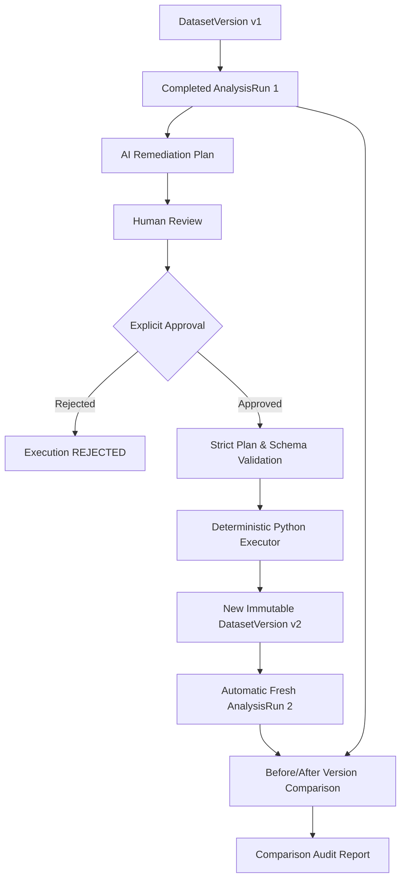

# Phase 5: Deterministic Remediation Execution, Immutable Version Creation & Before/After Comparison

## 1. Executive Summary & Core Philosophy

> **AI proposes. Human approves. Python executes.**

Dataset Doctor implements a closed-loop tabular remediation and versioning pipeline governed by a strict safety principle: **The LLM is an advisory reasoning agent, never an execution environment.**



### Safety Guarantee
- **Zero Arbitrary Execution:** No generated Python code, no `eval`/`exec`, no shell commands, no dynamic SQL, no dynamic filesystem access, and no network calls.
- **Strict Allowlist Only:** Only 5 deterministic operations: `REMOVE_DUPLICATES`, `CAST_TYPE`, `IMPUTE`, `CLIP_OUTLIERS`, and `DROP_COLUMN`.
- **Target Column Protection:** By default, modeling target columns cannot be dropped or directly modified by remediation plans.
- **Source Immutability:** Original `DatasetVersion` records and canonical Parquet files are read-only and permanently untouched.

---

## 2. Complete Remediation Lifecycle

1. **Source Context:** An existing immutable `DatasetVersion` (e.g. `v1`) and a completed deterministic `AnalysisRun`.
2. **AI Plan Synthesis:** Phase 4 AI service generates an advisory plan comprising allowlisted `TransformationSpec` entries grounded in deterministic findings.
3. **Human Review & Approval:** Human reviewer inspects the plan and explicitly invokes `POST /api/v1/analyses/{run_id}/remediations/apply` with `approval=True`.
4. **Plan Validation:** Prior to any mutation, `RemediationExecutor` validates the entire plan against current DataFrame schema, checking for parameter validity, target protection, and operation conflicts.
5. **Deterministic Execution:** Transformations are applied in an explicit, deterministic order on an in-memory copy of the DataFrame.
6. **Output Integrity Verification:** Output DataFrame is verified for valid dimensions, headers, and Parquet serializability.
7. **Immutable Version Creation:** A new `DatasetVersion` (e.g. `v2`) is registered with `parent_version_id=v1.id`, independent storage path, new SHA-256 hash, and structured change summary.
8. **Automatic Re-Analysis:** Fresh `AnalysisRun` is automatically submitted for `v2` preserving modeling targets, ensuring zero stale findings.
9. **Before/After Comparison:** Comparative audit contrasts `v1` vs `v2` across summary metrics, semantic defect transitions (`RESOLVED`, `CHANGED`, `UNCHANGED`, `NEW`), and ML readiness score changes.

---

## 3. Transformation Allowlist & Execution Order

### Supported Transformations

| Action | Allowed Parameters | Compatibility | Description |
|---|---|---|---|
| `REMOVE_DUPLICATES` | `subset: List[str]`, `keep: "first" \| "last" \| False` | All columns | Drops duplicate observations deterministically. |
| `CAST_TYPE` | `target_type: "int64" \| "float64" \| "string" \| "boolean" \| "datetime64[ns]"` | Compatible features | Safe, non-destructive type casting. Nullable types used when nulls exist. |
| `IMPUTE` | `strategy: "mean" \| "median" \| "mode" \| "constant"`, `fill_value` | `mean`/`median`: Numeric only; `mode`/`constant`: Any | Imputes missing cells only without altering existing values. Deterministic mode tie-breaking. |
| `CLIP_OUTLIERS` | `lower_quantile: float`, `upper_quantile: float` | Numeric only | Deterministically clips values outside quantile bounds $[q_{low}, q_{high}]$. |
| `DROP_COLUMN` | `column: str` or `columns: List[str]` | Non-target columns | Safely removes unneeded or defective features. Cannot drop modeling target or all columns. |

### Deterministic Ordering Strategy
Transformations are sorted into a strict canonical sequence:
1. **`REMOVE_DUPLICATES` (Weight 1):** Eliminating redundant rows first ensures subsequent statistical aggregations (mean, median, quantiles) are not distorted by duplicate rows.
2. **`CAST_TYPE` (Weight 2):** Casting string-encoded numbers or dates to proper types ensures downstream imputation and clipping operate on correct numeric types.
3. **`IMPUTE` (Weight 3):** Populating missing values allows subsequent quantile clipping to evaluate complete numerical distributions.
4. **`CLIP_OUTLIERS` (Weight 4):** Clipping extreme values on clean, imputed numeric features.
5. **`DROP_COLUMN` (Weight 5):** Removing features last avoids performing unnecessary computations on dropped columns and prevents dropping columns required by earlier steps.

---

## 4. Conflict Detection & Target Protection

Prior to applying any transformation, `RemediationExecutor.validate_plan` checks for:
- **Target Modification Protection:** Rejects plans dropping or modifying `target_column` with explicit policy violations.
- **Drop-and-Modify Conflicts:** Rejects plans that drop a column while simultaneously imputing, casting, or clipping it.
- **Multiple Redundant Operations:** Rejects multiple imputations, castings, or clippings on the same column.
- **All-Columns Removal:** Rejects plans that would result in zero columns.
- **All-Rows Removal:** Rejects duplicate removal operations that would eliminate all records.

---

## 5. Storage Consistency, SHA-256 & Provenance

### Immutable Version Lineage
```
storage/datasets/<dataset_id>/versions/
    ├── v1/
    │   ├── original/raw_data.csv
    │   └── data.parquet (SHA-256: e3b0c442...) [READ-ONLY]
    └── v2/
        └── data.parquet (SHA-256: 9b1a7f34...) [READ-ONLY]
```

- **Atomic Writes:** Remediated DataFrames are written to temporary artifacts (`.tmp_rem_*.parquet`) and atomically moved into canonical storage upon successful validation.
- **Failure Safety:** If validation, serialization, or database persistence fails, partial temporary files are deleted, `RemediationExecution` is marked `FAILED`, and the source version remains 100% untouched.
- **SHA-256 Divergence:** Every derived `DatasetVersion` computes and stores its own SHA-256 hash.
- **Granular Provenance:** Every transformation records:
  ```json
  {
    "action": "IMPUTE",
    "column": "age",
    "parameters": {"strategy": "mean"},
    "source_issue_ids": ["uuid"],
    "reason": "Impute missing age",
    "applied_order": 2,
    "rows_changed": 14,
    "columns_changed": 0,
    "before_metrics": {"missing_before": 14},
    "after_metrics": {"missing_after": 0, "imputed_value": "34.5"},
    "executor_version": "1.0.0",
    "executed_at": "2026-10-06T14:30:00Z"
  }
  ```

---

## 6. Before/After Version Comparison

Endpoint: `GET /api/v1/datasets/{dataset_id}/compare-versions?v1={v1_id}&v2={v2_id}`

### Deterministic Issue Semantic Keys
Issues across versions are identified not by database primary keys, but by semantic identity tuples:
$$\text{semantic\_key} = \text{module} : \text{category} : \text{column\_name}$$

### Issue Lifecycle States
- **`RESOLVED`:** Defect existed in `v1`, absent in `v2`.
- **`CHANGED`:** Defect present in both `v1` and `v2`, but severity transitioned (e.g. `HIGH` $\rightarrow$ `LOW`).
- **`UNCHANGED`:** Defect present in both versions with identical severity.
- **`NEW`:** Defect absent in `v1`, newly introduced in `v2`.

### ML Readiness Heuristic Comparison
Contrasts `before_score` vs `after_score` and calculates arithmetic delta:
$$\Delta = \text{after\_score} - \text{before\_score}$$
Includes mandatory safety disclaimer:
> *"The heuristic measures data quality/readiness signals, not actual model performance."*

---

## 7. API Endpoints Reference

| Method | Endpoint | Description |
|---|---|---|
| `POST` | `/api/v1/analyses/{run_id}/remediations/apply` | Approve and deterministically execute remediation plan. |
| `GET` | `/api/v1/remediations/{execution_id}` | Retrieve specific remediation execution record & provenance. |
| `GET` | `/api/v1/datasets/{dataset_id}/remediations` | List all historical remediation executions for a dataset. |
| `GET` | `/api/v1/datasets/{dataset_id}/compare-versions` | Compare two dataset versions and their deterministic findings. |

---

## 8. Known Boundaries & Limitations

1. **Single-User Approval Context:** For single-user and local environments, `approved_by` defaults to `"user"` or the supplied caller identifier.
2. **In-Memory Transformation Scope:** Transformations are executed using pandas and PyArrow in-memory structures suitable for tabular datasets fitting within host RAM.
3. **Target Protection Strictness:** Automatic transformations on target variables are prohibited by default; feature engineering on target columns must be performed prior to ingestion.
