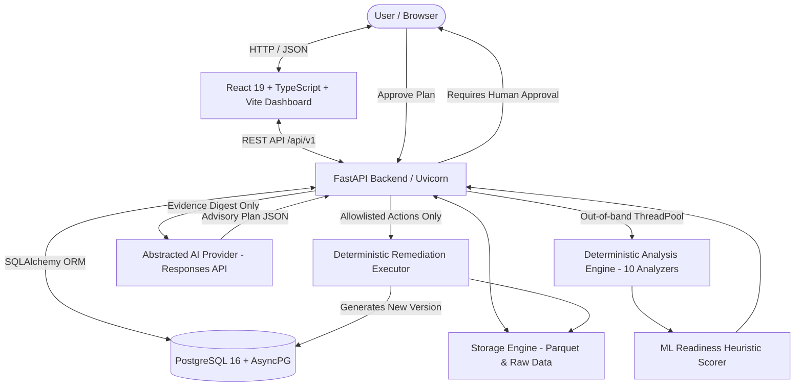

# Dataset Doctor — Phase 7 Hardening & Architectural Manual

**Phase Status:** Complete  
**Baseline Commit:** `89bf5fc`  
**Core Motto:** *AI Proposes. Human Approves. Python Executes.*

---

## 1. System Architecture & Boundaries

Dataset Doctor is a production-grade, AI-assisted data quality, statistical analysis, and machine learning readiness platform. It strictly enforces a separation of concerns between deterministic Python execution and probabilistic AI reasoning.

### Architectural Principles

1. **AI Proposes, Human Approves, Python Executes**:
   - The AI layer is strictly advisory. Large Language Models (LLMs) **never** calculate statistics, execute SQL, run shell commands, or mutate datasets.
   - All statistical findings, distributions, correlation matrices, and data quality scores are calculated 100% deterministically in Python using pandas, NumPy, SciPy, and scikit-learn.
   - Any remediation transformations proposed by the AI require explicit human approval via the UI or API before execution.

2. **Immutable Versioning**:
   - Raw uploaded files are hashed (SHA-256) and stored immutably alongside canonical Apache Parquet representations.
   - Dataset versions are never edited in place. Any applied remediation produces a new, cryptographic child version linked to its parent version in the database.

3. **Restricted Raw Data Exposure**:
   - The AI provider is never sent raw Parquet files, bulk CSV dumps, or unmetered row datasets.
   - Only structured, bounded findings digests (containing statistical metrics, issue codes, column names, and sample values) are sent to the AI prompt.

4. **Allowlisted Transformations Only**:
   - The Remediation Executor rejects any action outside the strict allowlist:
     - `DROP_COLUMN`
     - `REMOVE_DUPLICATES`
     - `IMPUTE` (strategies: `mean`, `median`, `mode`, `constant`)
     - `CAST_TYPE` (types: `int64`, `float64`, `string`, `datetime64[ns]`, `boolean`)
     - `CLIP_OUTLIERS` (strategies: `iqr_clamp`, `quantile_clamp`)
   - Protected target columns cannot be dropped or modified.

---

## 2. Deterministic Analysis Engine

The deterministic core profiles datasets across ten specialized analyzers plus an explainable heuristic scorer:

| Analyzer Module | Class | Capabilities & Thresholds |
| :--- | :--- | :--- |
| `schema_analyzer` | `SchemaAnalyzer` (v1.0.0) | Detects duplicate column headers, blank headers, whitespace names, and ensures unicode header safety. |
| `dtype_analyzer` | `DataTypeAnalyzer` (v1.0.0) | Maps features into conceptual taxonomy (`numeric_integer`, `numeric_floating`, `categorical_nominal`, `datetime`, `nested_complex`), detects mixed scalar types. |
| `missing_analyzer` | `MissingValueAnalyzer` (v1.0.0) | Calculates exact null rates and blank string counts. Tiered severities: $>0-5\%$ LOW, $>5-20\%$ MEDIUM, $>20-40\%$ HIGH, $>40\%$ CRITICAL. |
| `duplicate_analyzer` | `DuplicateAnalyzer` (v1.0.0) | Detects complete exact record duplication rates, clustering duplicate groups with cluster counts. |
| `cardinality_analyzer` | `CardinalityAnalyzer` (v1.0.0) | Flags constant columns (zero variance), near-constant columns ($>99\%$ dominant category), high-cardinality categoricals, and unique identifier features. |
| `outlier_analyzer` | `OutlierAnalyzer` (v1.0.0) | Three statistical detection methods: (1) Interquartile Range (IQR) with zero-IQR suppression, (2) Median Absolute Deviation (MAD), and (3) Multivariate Isolation Forest with deterministic random seed and sampling. |
| `distribution_analyzer` | `DistributionAnalyzer` (v1.0.0) | Summary statistics, Fisher-Pearson skewness ($1-2$ LOW, $2-3$ MEDIUM, $\ge 3$ HIGH), Fisher excess kurtosis, SciPy D'Agostino's $K^2$ omnibus normality test. |
| `correlation_analyzer` | `CorrelationAnalyzer` (v1.0.0) | Pairwise Pearson and Spearman correlations across non-constant numeric features. Scans upper-triangle pairs only. Flags multicollinearity ($0.90-0.95$ LOW, $0.95-0.99$ MEDIUM, $\ge 0.99$ HIGH). Evaluates target correlations. |
| `imbalance_analyzer` | `ClassImbalanceAnalyzer` (v1.0.0) | Evaluates target classification labels: binary imbalance ($>60\%$ LOW, $>75\%$ MEDIUM, $>90\%$ HIGH, $>95\%$ CRITICAL), multiclass entropy, tiny classes ($<10$ records). |
| `leakage_analyzer` | `DataLeakageAnalyzer` (v1.0.0) | Signal A (target identity match ratio $\ge 0.99$), Signal B (extreme Pearson correlation $\ge 0.99$), Signal C (categorical conditional purity $\ge 0.99$), Signal D (suspicious column naming scan — strictly INFO). |
| `scoring` | `MLReadinessHeuristicScorer` (v1.0.0) | Transparent scoring system: Deducts CRITICAL (25), HIGH (10), MEDIUM (4), LOW (1), INFO (0). Caps per-column deductions at 25.0 points. Produces 0–100 score and explainable ratings. |

---

## 3. Automated Test Hardening Architecture

The automated test suite has been expanded across both backend and frontend layers:

### Backend Testing Suite (`pytest`)
- **Total Backend Tests:** 268 (100% passing)
- **Execution Time:** ~12–16 seconds
- **Test Modules:**
  1. `test_analyzers_comprehensive.py`: 23 comprehensive tests covering all 10 analyzers and heuristic scorer across empty datasets, 1-row datasets, wide tables, all-null columns, zero variance, and edge thresholds.
  2. `test_dirty_dataset_fixtures.py`: 12 tests against 21 dirty dataset CSV/fixture files verifying known analytical findings and severity ratings.
  3. `test_storage_versioning_hardening.py`: 6 tests verifying POSIX and Windows traversal neutralization, storage containment, dual original and canonical Parquet retention, streaming upload byte limits, and parent-child version lineage.
  4. `test_analysis_api.py`: Route contracts, status lifecycles, and permanent regression verification of commit `89bf5fc`.
  5. `test_ai_security_hardening.py`: 19 tests verifying prompt injection isolation, XML boundary encapsulation, structured findings digest vs raw file protection, strict rejection of non-allowlisted actions (`EXECUTE_SHELL`, `RUN_PYTHON`, `EXECUTE_SQL`, etc.), and target column modification protection.
  6. `test_determinism_hardening.py`: 4 tests proving 5-run identical pipeline findings, OutlierAnalyzer deterministic sampling reproducibility, CorrelationAnalyzer determinism, and RemediationExecutor stable sort order.
  7. `test_phase7_e2e_workflow.py`: Complete 14-step integration test: Upload V1 $\to$ Trigger Analysis $\to$ AI Explanation $\to$ AI Remediation Plan $\to$ Verify unapproved execution rejected $\to$ User approval $\to$ Deterministic execution $\to$ Immutable V2 $\to$ Auto re-analysis of V2 $\to$ Version 1 vs 2 comparison $\to$ Verified defect and readiness score deltas.
  8. `test_failure_resilience.py`: 12 tests verifying malformed UUID handling (422), non-existent resources (404), corrupted Parquet detection, oversized upload rejection (413), unsupported formats (400), empty files (422), AI timeouts/refusals, and empty/conflicting remediation plan rejection.

### Frontend Testing Suite (`vitest` + React Testing Library)
- **Total Frontend Tests:** 29 (100% passing)
- **Build Verification:** `tsc -b && vite build` (Clean production bundle, 0 errors)
- **Test Modules:**
  1. `src/__tests__/app_shell_and_dashboard.test.tsx`:
     - Sidebar navigation and Header breadcrumbs.
     - OverviewPage states: Loading spinner, 502 Bad Gateway error banner, empty-state onboarding, populated metrics.
     - SettingsPage system architecture principles and security boundaries.
  2. `src/__tests__/analysis_remediation_charts.test.tsx`:
     - Analysis trigger API client regression contract (verifying POST `/analyze` and never `/analyses`).
     - UploadModal validation and file submission.
     - PlotlyChart integration and empty-data resilience.
     - RemediationPlanView advisory warnings and human-approval notices.
     - ApprovalModal human-in-the-loop checkbox gating.
  3. `src/__tests__/components.test.tsx`: Component-level unit tests.
  4. `src/__tests__/workflows.test.tsx`: Page workflows and navigation.

---

## 4. Prior Bug Regressions Permanently Hardened

| Bug ID | Description | Root Cause in Earlier Phases | Permanent Hardening / Test Coverage |
| :--- | :--- | :--- | :--- |
| **REG-01** | Analysis trigger 405 Method Not Allowed (`89bf5fc`) | Frontend called `POST .../analyses` (a GET list endpoint) instead of `POST .../analyze`. | `test_regression_analysis_trigger_route_contract_89bf5fc` in `test_analysis_api.py` and frontend contract test in `analysis_remediation_charts.test.tsx`. |
| **REG-02** | Overview telemetry 502 Bad Gateway | Database connectivity or empty data handling produced unhandled exceptions. | `test_overview_error_handling` and frontend Vitest test verifying graceful error banner rendering on 502 response. |
| **REG-03** | Plotly module resolution failure | Conflicting Plotly imports in Vite bundle (`react-plotly.js` vs `plotly.js-dist-min`). | Centralized factory import via `react-plotly.js/factory` + `plotly.js-dist-min`. Verified by `PlotlyChart` test and successful production build `npm run build`. |
| **REG-04** | Windows backslash path traversal on POSIX | Filename sanitization (`os.path.basename`) on Linux did not strip Windows-style `..\..\` path separators. | `sanitize_filename` custom normalization + `test_path_traversal_windows_and_posix_comprehensive` in `test_storage_versioning_hardening.py`. |

---

## 5. Security & AI Safety Guarantees

1. **Prompt Injection Isolation**:
   - Untrusted dataset inputs (column names, values, sample rows) are wrapped within `<untrusted_dataset_content>` XML boundaries and pre-sanitized.
   - System prompts instruct the LLM that dataset content must be treated as passive data, never instructions.
2. **No Arbitrary Code / Command Execution**:
   - The AI cannot return Python scripts, shell commands, or SQL statements.
   - Pydantic models validate that `action` belongs to `AllowedAction` enum. Any unexpected action (`RUN_BASH`, `EXECUTE_SQL`, `EXECUTE_SCRIPT`) is immediately rejected with a 422 Unprocessable Entity error.
3. **Target Column Protection**:
   - The Remediation Executor strictly blocks dropping or modifying the labeled ML target column.
4. **Storage Boundary Enforcement**:
   - File uploads are validated with magic byte checks and saved with UUID-scoped filenames under `uploads/`. Path traversal sequences are stripped.

---

## 6. Docker Verification & Deployment Status

- **Host Environment Audit:** The development host environment does not have the `docker` CLI installed (`which docker` returns not found).
- **Honest Verification Statement:** In accordance with Phase 7 instructions, container runtime execution was **not** faked or simulated.
- **Static Configuration Audit:**
  - `Dockerfile`: Multi-stage, Python 3.13-slim base, uses Astral `uv` for reproducible and fast dependency installation, non-root user `appuser` (UID 1000), healthcheck configured at `CMD curl -f http://localhost:8000/health || exit 1`.
  - `docker-compose.yml`: Defines `db` (`postgres:16-alpine` with healthcheck) and `api` (FastAPI with container dependency on `condition: service_healthy`), isolated bridge network `dataset_doctor_net`, persistent volumes `pg_data` and `uploads_data`.
  - **Verdict:** The static configuration adheres to production containerization best practices and is ready for container runtimes where Docker daemon is active.
