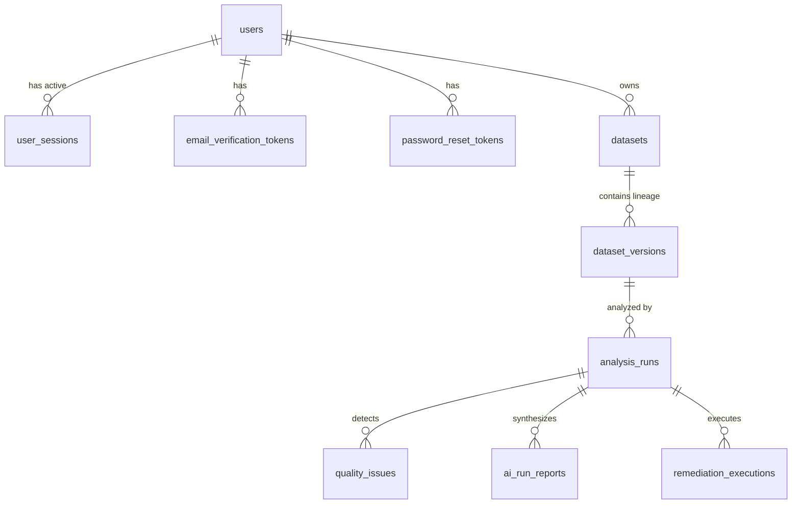

# Dataset Doctor — Public Launch Phase 1
## Authentication, Authorization & Multi-User Data Isolation Architecture

This document specifies the technical design, security controls, database migrations, authorization rules, and operational requirements for the Dataset Doctor Public Launch Phase 1.

---

## 1. Architectural Overview

Dataset Doctor is transitioning from a single-tenant local analytical tool to a public multi-tenant web application. Phase 1 establishes the foundational security architecture:
- Users register accounts, verify email ownership, and authenticate via secure server-side sessions.
- All datasets, versions, analysis profiles, heuristic scores, findings, AI remediation plans, and remediation executions are strictly isolated per user account.
- Legacy unowned datasets remain isolated and inaccessible to registered users.
- Authorization fails closed (default-deny) across every API route.

---

## 2. Authentication & Session Security

### 2.1 Password Security
- **Argon2id Hashing**: Passwords are hashed using Argon2id via the standard `argon2-cffi` library (`$argon2id$v=19$m=65536,t=3,p=4`), providing quantum-resistant memory-hard protection against ASIC/GPU brute-force attacks.
- **Constant-Time Verification**: Verification uses constant-time string comparisons to prevent timing attacks.
- **Constraints**: Passwords require a minimum length of 8 characters and a maximum length of 128 characters.

### 2.2 Server-Side Session Management
- **Token Generation**: Session identifiers are generated using Python's `secrets.token_urlsafe(32)`, yielding 256 bits of cryptographic entropy.
- **Storage**: Plaintext session tokens are never stored in the database. Instead, only a deterministic SHA-256 hash (`session_token_hash`) is persisted in `user_sessions`.
- **Session Delivery**:
  - The raw session token is transmitted strictly via an `HttpOnly` cookie (`dd_session`).
  - `SameSite=Lax` prevents cross-site request forgery in standard navigation.
  - `Secure=True` in production ensures cookies are only transmitted over TLS/HTTPS.
  - Tokens are never exposed in URL query parameters or browser `localStorage`.
- **Session Rotation & Invalidation**:
  - A new session token is generated on every successful login.
  - Calling `POST /api/v1/auth/logout` explicitly deletes the session record from the database and instructs the browser to expire the cookie (`Max-Age=0`).
  - Completing a password reset revokes **all** active sessions across all devices for that user.
  - Deactivating a user immediately invalidates active sessions.

### 2.3 Non-Disclosing Responses
- Login failures return a generic error message: `Invalid email address or password.` regardless of whether the email exists.
- Password reset requests return: `If an account exists with this email address, password reset instructions have been sent.` regardless of account existence.
- Resource unauthorized access returns HTTP 404 (Entity Not Found) rather than disclosing the existence of another tenant's records.

---

## 3. Data Model & Database Schema

The authentication and ownership schema is implemented via Alembic migration `0005_create_auth_and_user_tables.py`:



### Table Definitions:
1. **`users`**:
   - `id`: UUID (Primary Key)
   - `email`: VARCHAR(255) UNIQUE, indexed (normalized to lowercase)
   - `hashed_password`: VARCHAR(255) (Argon2id hash)
   - `is_active`: BOOLEAN (default True)
   - `is_verified`: BOOLEAN (default False)
   - `role`: VARCHAR(32) (default 'user')
   - `created_at` / `updated_at`: TIMESTAMPTZ
2. **`user_sessions`**:
   - `id`: UUID (Primary Key)
   - `user_id`: UUID (Foreign Key `users.id`, ON DELETE CASCADE)
   - `session_token_hash`: VARCHAR(64) UNIQUE, indexed (SHA-256)
   - `ip_address`: VARCHAR(45)
   - `user_agent`: VARCHAR(512)
   - `expires_at`: TIMESTAMPTZ, indexed
   - `last_active_at`: TIMESTAMPTZ
   - `created_at`: TIMESTAMPTZ
3. **`email_verification_tokens`**:
   - `id`: UUID (Primary Key)
   - `user_id`: UUID (Foreign Key `users.id`, ON DELETE CASCADE)
   - `token_hash`: VARCHAR(64) UNIQUE, indexed (SHA-256)
   - `expires_at`: TIMESTAMPTZ, indexed
   - `used_at`: TIMESTAMPTZ (NULL until consumed)
   - `created_at`: TIMESTAMPTZ
4. **`password_reset_tokens`**:
   - `id`: UUID (Primary Key)
   - `user_id`: UUID (Foreign Key `users.id`, ON DELETE CASCADE)
   - `token_hash`: VARCHAR(64) UNIQUE, indexed (SHA-256)
   - `expires_at`: TIMESTAMPTZ, indexed
   - `used_at`: TIMESTAMPTZ (NULL until consumed)
   - `created_at`: TIMESTAMPTZ
5. **`datasets`** (Updated):
   - Added column `owner_id`: UUID (Foreign Key `users.id`, ON DELETE SET NULL), indexed.
   - Nullable to protect legacy test/development datasets.

---

## 4. Protected API Route Audit Matrix

Every endpoint verifies that the resource belongs to the authenticated user. Authorization checks are default-deny and fail closed.

| Route | Method | Access Level | Ownership Verification Strategy |
| :--- | :--- | :--- | :--- |
| `/api/v1/health` | GET | Public | System health probe |
| `/api/v1/auth/register` | POST | Public | Rate limited (10/min) |
| `/api/v1/auth/login` | POST | Public | Rate limited (10/min), sets `HttpOnly` cookie |
| `/api/v1/auth/logout` | POST | Authenticated | Clears session cookie and invalidates in DB |
| `/api/v1/auth/me` | GET | Authenticated | Returns current authenticated user |
| `/api/v1/auth/verify-email` | POST | Public | Validates and consumes single-use token |
| `/api/v1/auth/forgot-password` | POST | Public | Rate limited (5/min), dispatches reset token |
| `/api/v1/auth/reset-password` | POST | Public | Consumes reset token and invalidates all sessions |
| `/api/v1/datasets/upload` | POST | Authenticated | Creates dataset with `owner_id = current_user.id`. If new version, checks `target.owner_id == current_user.id` |
| `/api/v1/datasets` | GET | Authenticated | Filters `Dataset.owner_id == current_user.id` |
| `/api/v1/datasets/{dataset_id}` | GET | Authenticated | Verified: `Dataset.owner_id == current_user.id` |
| `/api/v1/datasets/{dataset_id}/versions/{v}/preview` | GET | Authenticated | Verified: `Dataset.owner_id == current_user.id` |
| `/api/v1/datasets/{dataset_id}/versions/{v}/analyze` | POST | Authenticated | Verified: `Dataset.owner_id == current_user.id` |
| `/api/v1/analyses/{run_id}` | GET | Authenticated | Verified: `run -> version -> dataset.owner_id == current_user.id` |
| `/api/v1/analyses/{run_id}/heuristic` | GET | Authenticated | Verified: `run -> version -> dataset.owner_id == current_user.id` |
| `/api/v1/analyses/{run_id}/issues` | GET | Authenticated | Verified: `run -> version -> dataset.owner_id == current_user.id` |
| `/api/v1/datasets/{d}/versions/{v}/analyses` | GET | Authenticated | Verified: `Dataset.owner_id == current_user.id` |
| `/api/v1/analyses/{run_id}/visualizations` | GET | Authenticated | Verified: `run -> version -> dataset.owner_id == current_user.id` |
| `/api/v1/overview/stats` | GET | Authenticated | Scoped: All metric aggregates filtered by `Dataset.owner_id == current_user.id` |
| `/api/v1/analyses/{run_id}/issues/{iss}/explain` | POST | Authenticated | Verified: `run -> version -> dataset.owner_id == current_user.id` |
| `/api/v1/analyses/{run_id}/generate-ai-plan` | POST | Authenticated | Verified: `run -> version -> dataset.owner_id == current_user.id` |
| `/api/v1/analyses/{run_id}/ai-plan` | GET | Authenticated | Verified: `run -> version -> dataset.owner_id == current_user.id` |
| `/api/v1/analyses/{run_id}/remediations/apply` | POST | Authenticated | Verified: `run -> version -> dataset.owner_id == current_user.id`, `approved_by` derived from session |
| `/api/v1/remediations/{exec_id}` | GET | Authenticated | Verified: `exec -> run -> dataset.owner_id == current_user.id` |
| `/api/v1/datasets/{dataset_id}/remediations` | GET | Authenticated | Verified: `Dataset.owner_id == current_user.id` |
| `/api/v1/datasets/{dataset_id}/compare-versions` | GET | Authenticated | Verified: `Dataset.owner_id == current_user.id` |

---

## 5. Abuse Prevention & Rate Limiting

A thread-safe in-process sliding-window rate limiter (`app/core/rate_limit.py`) enforces strict thresholds across sensitive operations:

| Operation | Scope | Window | Limit | Response |
| :--- | :--- | :--- | :--- | :--- |
| Account Registration | Client IP | 60 seconds | 10 requests | HTTP 429 (`Retry-After`) |
| Login Attempts | Client IP | 60 seconds | 10 requests | HTTP 429 (`Retry-After`) |
| Password Reset Requests | Client IP | 60 seconds | 5 requests | HTTP 429 (`Retry-After`) |
| Email Verifications | Client IP | 60 seconds | 10 requests | HTTP 429 (`Retry-After`) |
| Dataset Uploads | User UUID | 60 seconds | 20 uploads | HTTP 429 (`Retry-After`) |
| Analysis Triggers | User UUID | 60 seconds | 10 triggers | HTTP 429 (`Retry-After`) |
| AI Explanations | User UUID | 60 seconds | 20 requests | HTTP 429 (`Retry-After`) |
| AI Remediation Plans | User UUID | 60 seconds | 10 plans | HTTP 429 (`Retry-After`) |
| Remediation Execution | User UUID | 60 seconds | 10 executions | HTTP 429 (`Retry-After`) |

*Note for production deployment: Ingress reverse-proxies (e.g. NGINX, Cloudflare) must provide global IP-level rate limiting and request body buffering as a secondary perimeter defense.*

---

## 6. Email Delivery Abstraction

The application abstracts email delivery via `BaseEmailService` (`app/services/email_service.py`):
- **Development/Testing (`MockEmailService`)**: Logs outgoing verification and reset emails in-memory and to application logs without external network calls.
- **Production (`SMTPEmailService`)**: Sends HTML and plaintext emails using standard STARTTLS/TLS SMTP.
- Configured via environment variables:
  - `SMTP_HOST`: Hostname of SMTP relay (e.g. `smtp.sendgrid.net`, `smtp.mailgun.org`, `email-smtp.us-east-1.amazonaws.com`)
  - `SMTP_PORT`: Port (default `587`)
  - `SMTP_USER`: SMTP username / API key ID
  - `SMTP_PASSWORD`: SMTP secret / API key
  - `SMTP_TLS`: TLS flag (`true`)
  - `EMAIL_FROM`: Verified sender address (e.g. `noreply@datasetdoctor.com`)

---

## 7. Frontend Integration & UX

- **AuthContext**: React context providing reactive session state (`user`, `isAuthenticated`, `isLoading`, `login`, `register`, `logout`).
- **Route Guarding**: `ProtectedRoute` component checks session status. When unauthenticated, visitors are redirected to `/login` with target path preserved in location state for seamless post-login redirection.
- **Header Profile**: Displays the authenticated user's email, verification warning pill if unverified, and a one-click sign-out button.
- **Error Boundaries**: Preserved across all routes to prevent full-screen blank crashes during transient network errors.

---

## 8. Legacy Data Migration & Safety Policy

Local development databases may contain existing datasets where `owner_id IS NULL`:
- **Safe Isolation**: Queries strictly filter `Dataset.owner_id == current_user.id`. Therefore, unowned datasets are hidden from ordinary registered users.
- **Production Freshness**: For the public launch, a clean database instance must be deployed. Development data should never be migrated to the public cluster.
- **Local Developer Backfill**: Developers who wish to claim local datasets can run:
  ```sql
  UPDATE datasets SET owner_id = '<your-user-uuid>' WHERE owner_id IS NULL;
  ```
